 ICS344 Project: SSH Attack and Monitoring (Splunk + Fail2Ban)

## Project Overview

This project demonstrates a complete scenario of an SSH attack using reverse shells, followed by monitoring and defense using **Splunk** and **Fail2Ban**. It is divided into three main phases:

- **Phase 1:** Initial reverse shell connection and basic shell interaction.
- **Phase 2:** Monitoring SSH attack activities using Splunk.
- **Phase 3:** Hardening the system with Fail2Ban against SSH brute-force attacks.

Each phase shows detailed steps, commands, and configurations captured with screenshots to explain the setup and the results.

---

## Phase 1: SSH Reverse Shell Attack

In Phase 1, we manually crafted and launched a basic **SSH Reverse Shell** to gain access to the Metasploitable3 vulnerable machine.

### 1. Creating the Reverse Shell Script
We used a Python script (`ssh_reverse_shell_1_2.py`) that initiates an SSH connection back to the attacker's machine. The code imports socket and subprocess libraries to create a listening socket and execute shell commands remotely.

### 2. Launching Netcat Listener
On the attacker's Kali Linux machine, we used:

```
nc -lvnp 4444
```

to listen for incoming connections on port 4444.

### 3. Executing the Reverse Shell
We ran the Python script from the Metasploitable3 VM. Upon execution, the shell successfully connected back to the attacker's machine, providing terminal access as the `vagrant` user.

### 4. Confirmation
Commands like `whoami` were used to verify access.

**Images:**

- 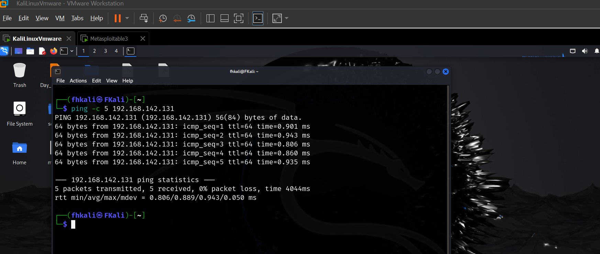
- 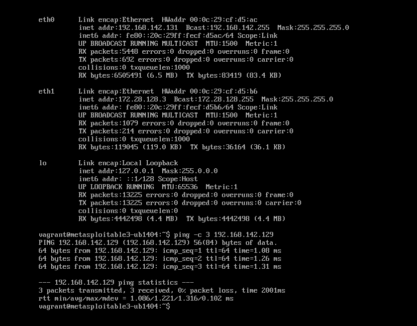
- 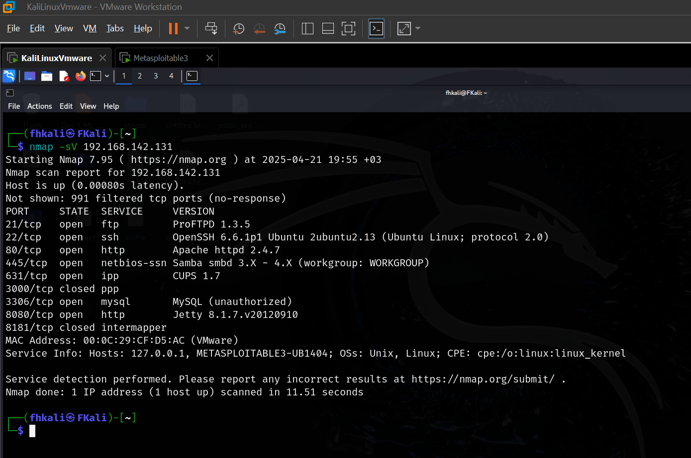

---

## Phase 2: SSH Attack Detection and Monitoring with Splunk

In Phase 2, we monitored the attack activities by configuring Splunk to capture and analyze SSH logs.

### 1. Setting up Splunk Forwarder
Installed Splunk Universal Forwarder on Metasploitable3, configured forwarding to Splunk Enterprise Server at `192.168.142.129:9997`, and added `/var/log/auth.log` as the monitored log source.

### 2. Configuring Splunk Receiver
Enabled port 9997 on Splunk Enterprise to receive forwarded data.

### 3. Log Injection and Search
Injected test logs manually using `logger` to simulate SSH activities and searched for events:

```
index=* source="/var/log/auth.log"
```

### 4. Building Splunk Dashboards
Created visualizations categorizing SSH authentication attempts, successful sessions, and reverse shell sessions.

**Key Commands:**

```
sudo /opt/splunkforwarder/bin/splunk add forward-server 192.168.142.129:9997
sudo /opt/splunkforwarder/bin/splunk add monitor /var/log/auth.log
sudo /opt/splunkforwarder/bin/splunk enable boot-start
```

**Images:**

- 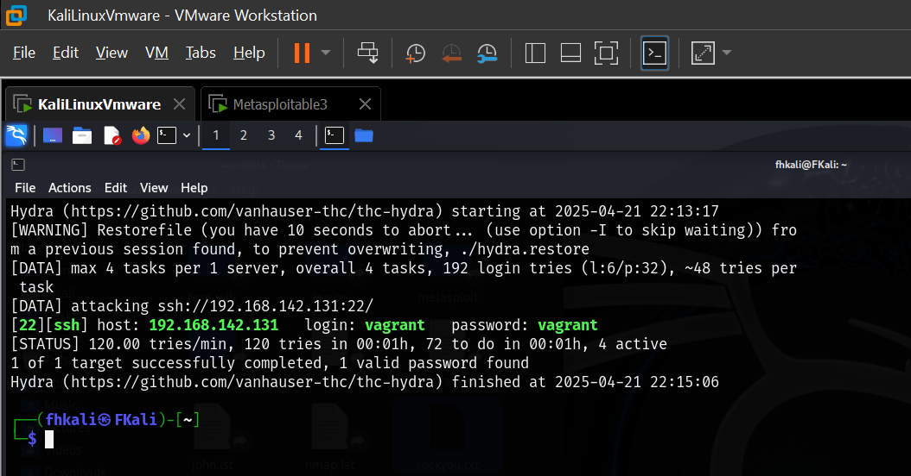
- 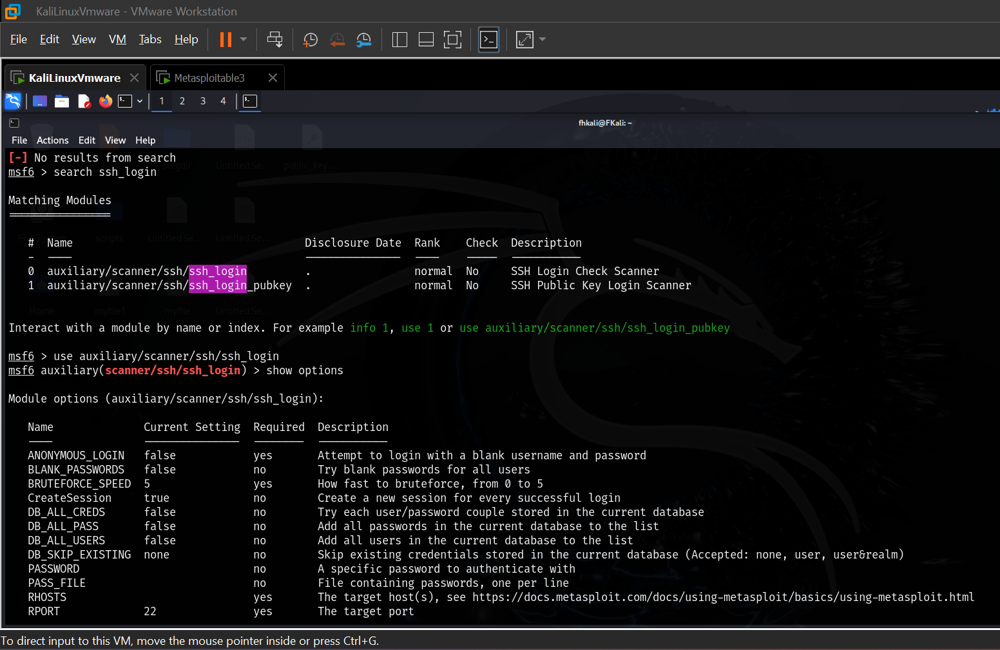
- 
- 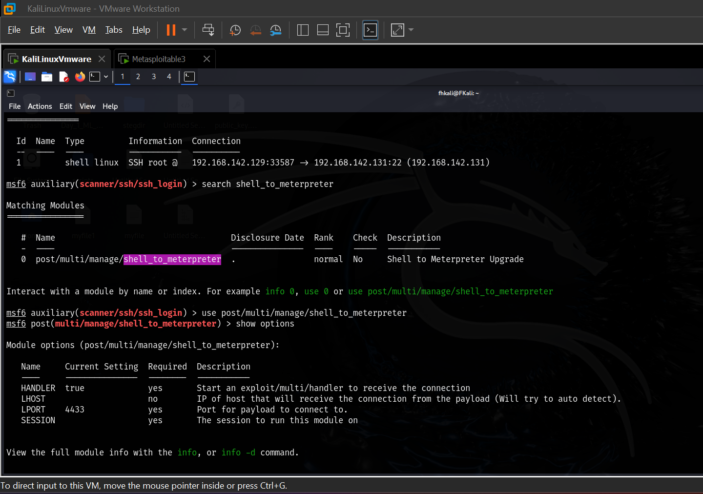
- 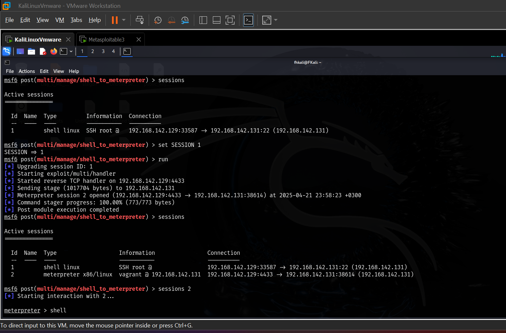
- 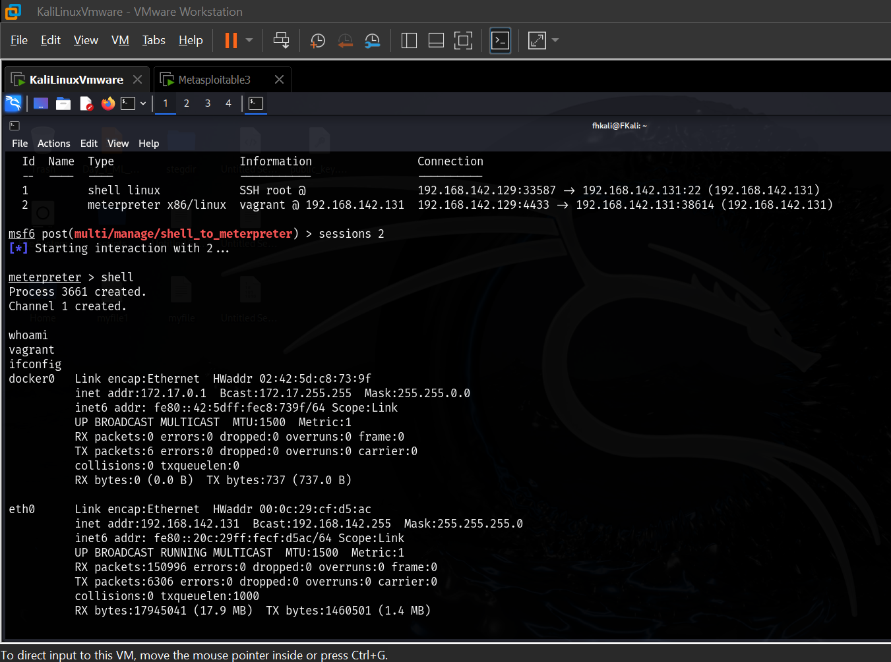
- 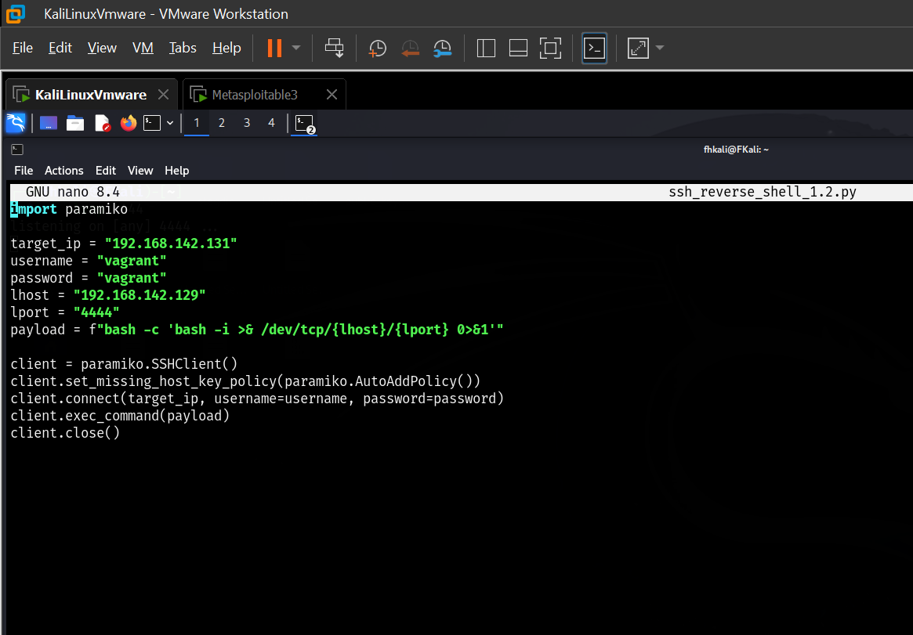
- 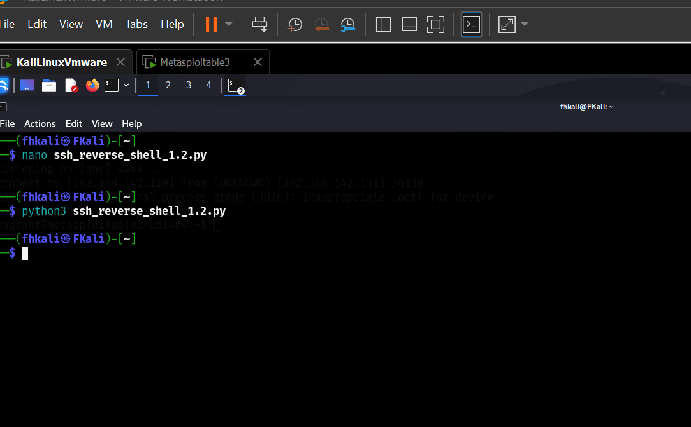
- 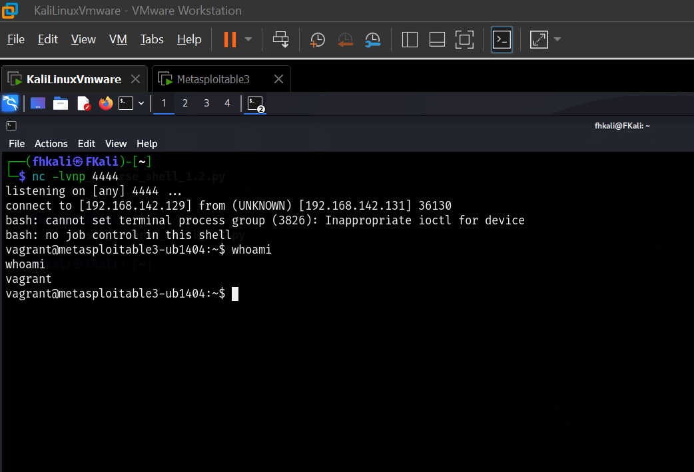

---

## Phase 3: System Hardening with Fail2Ban

In Phase 3, we added **Fail2Ban** to protect the Metasploitable3 server against SSH brute-force attacks.

### 1. Installing Fail2Ban
Installed using:

```
sudo apt-get install fail2ban -y
```

### 2. Configuring Fail2Ban
Edited `/etc/fail2ban/jail.local` to enable SSH jail monitoring:

```
[sshd]
enabled = true
port = ssh
logpath = /var/log/auth.log
maxretry = 3
bantime = 600
findtime = 300
```

### 3. Testing Fail2Ban
Simulated multiple wrong password attempts from Kali Linux and verified the banning process with:

```
sudo fail2ban-client status sshd
```

The attacker's IP was successfully banned after multiple failed login attempts.

**Images:**

- 
- 

---

## Conclusion

This project successfully demonstrated a full attack-defense cycle using SSH reverse shells and detection mechanisms. We first simulated an attack by gaining shell access through a Python-based reverse shell. Then, we collected and visualized logs using Splunk, creating dashboards to categorize login attempts, successful accesses, and possible reverse shell sessions. Finally, we hardened the server by implementing Fail2Ban, effectively detecting and blocking brute-force attempts.

Through this project, we highlighted the importance of:

- **Monitoring critical logs** (e.g., `/var/log/auth.log`)
- **Detecting anomalies early** using powerful tools like Splunk
- **Automated protection** using Fail2Ban to ban malicious IPs quickly

This practical exercise improves overall understanding of cyberattack techniques and defense strategies in real-world environments.

---

# END ✅

